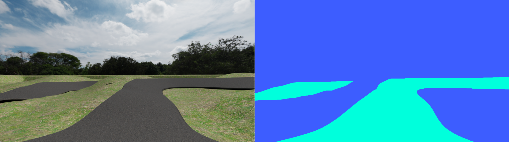

# Autoware-RoboRacer Off-road Simulator

The Autoware-RoboRacer Off-road Simulator is a multi-vehicle high-fidelity simulation framework for **Autoware** and **RoboRacer** off-road race cars, built on [NVIDIA Isaac Sim](https://developer.nvidia.com/isaac-sim) with **ROS 2 Humble** integration. This simulator was developed for the **Autoware Off-road** project to facilitate the training and evaluation of autonomous driving algorithms within off-road and racing ODDs. This research is part of an ongoing collaboration between the Autoware Off-road/Racing Working Group and the Autoware Center of Excellence (CoE) at the University of Pennsylvania.

The simulator features a **1/5th-scale RoboRacer-Max** model equipped with a comprehensive sensor suite: **3D LiDAR**, **RGB camera**, **GNSS**, **IMU**, and **odometry**. It includes a high-fidelity **pumptrack_simple** environment, featuring non-planar terrain specifically designed for challenging off-road testing. The framework facilitates **multi-vehicle configurations** via a versatile control interface that detects incoming **Autoware** and **RoboRacer** control message types, while supporting seamless **Hardware-in-the-Loop (HIL) testing** via CycloneDDS. Additional tools include a **semantic segmentation recorder** for perception training, built-in **keyboard teleoperation** for manual control, and an optimized launch and config system that is easy to use and ensures a perfect balance between simulation fidelity and real-time performance.

To refer to full Isaac Sim documentation, visit [Isaac Sim Documentation](https://docs.isaacsim.omniverse.nvidia.com/6.0.0/index.html).

---

## Table of Contents

1. [Prerequisites](#prerequisites)
2. [Docker Setup](#docker-setup)
3. [Running the Simulation](#running-the-simulation)
4. [Keyboard Control](#keyboard-control)
5. [User Interface](#user-interface)
6. [ROS 2 Topics](#ros-2-topics)
7. [Control Interface](#control-interface)
8. [Multi-Vehicle Setup](#multi-vehicle-setup)
9. [Distributed Mode and Hardware-in-the-Loop (HIL) Testing](#distributed-mode-and-hardware-in-the-loop-hil-testing)
10. [Surface Friction](#surface-friction)
11. [Semantic Segmentation Dataset Recording](#semantic-segmentation-dataset-recording)
12. [Performance Tuning](#performance-tuning)
13. [Utility Scripts](#utility-scripts)
14. [Troubleshooting](#troubleshooting)
15. [License](#license)

---

## Prerequisites

| Requirement | Version |
|---|---|
| NVIDIA GPU | RTX 4070+ recommended |
| NVIDIA Driver | 580+ |
| Docker | 24+ |
| NVIDIA-Container-Toolkit | [1.14.0+](https://docs.nvidia.com/datacenter/cloud-native/container-toolkit/latest/install-guide.html) |
| Host OS | Ubuntu 22.04+ (any Linux distro with X11 and NVIDIA driver support) |
| Disk Space | 45GB+ |

---

## Docker Setup

The container builds [NVIDIA Isaac Sim](https://github.com/isaac-sim/IsaacSim) from source alongside ROS 2 Humble. The first build takes 30–60 minutes.

### 1. Clone the Repository
```bash
git clone https://github.com/mlab-upenn/autoware_off-road_sim
cd autoware_off-road_sim
```

### 2. Build the Docker Image

```bash
./docker/build.sh
```

> **Note:** `Isaac Sim 6.0 Early Developer Release` is built by default. To use `Isaac Sim 5.1`, edit `docker/Dockerfile` and remove `-b develop` from the `git clone` command.

### 3. Launch the Container

```bash
./docker/run.sh
```

This automatically:
- Mounts the repo as `/workspace/autoware_off-road_sim`
- Enables GPU access via `--runtime=nvidia`
- Forwards X11 for the GUI
- Sets the working directory to `/workspace/autoware_off-road_sim`

---

## Running the Simulation

Always use the custom Python interpreter bundled with Isaac Sim — standard `python3` does not have the `omni.*` packages.

To run the RoboRacer-Max on pumptrack_simple environment demo, inside the container:

```bash
/root/isaacsim/_build/linux-x86_64/release/python.sh scripts/launch_sim.py 
```

This will run the simulation with the default configuration file: `scripts/configs/pumptrack_simple_config.yaml`.

To run with a different configuration file, use the `--config` flag:

```bash
/root/isaacsim/_build/linux-x86_64/release/python.sh scripts/launch_sim.py --config <path-to-config>
```

> **Note:** Shader compilation takes several minutes on first launch. Isaac Sim can feel unresponsive during this time.

> **Note:** There are two `[Error] [omni.physicsschema.plugin] Joint body relationship points to a non existent prim, joint will not be created.` messages at launch. These errors do not affect the simulation and can be ignored for now.

The launch script will:
1. Load the environment USD asset
2. Spawn all enabled vehicles from config with correct positions/orientations
3. Remap all sensor topics per vehicle (no conflicts in multi-vehicle mode)
4. Start the ROS 2 bridge
5. Inject keyboard control via the ActionGraph

### Headless Mode

Add `--headless` to run the simulator without a display window. This is useful for **Distributed mode and Hardware-in-the-Loop testing**, **CI pipelines**, and **remote/server deployments** where no monitor is attached.

```bash
/root/isaacsim/_build/linux-x86_64/release/python.sh scripts/launch_sim.py \
  --config scripts/configs/pumptrack_simple_config.yaml --headless
```

**Differences from normal mode:**

| Feature | Normal | Headless |
|---|---|---|
| Default control mode | `KEYBOARD_CONTROL` | `ROS2_CONTROL` (all vehicles) |
| Keyboard control | Available (hold `1`/`2` to toggle) | Not available |

In headless mode all vehicles start directly in **ROS2_CONTROL** — no need to hold `1` or `2` to enable ROS 2 commands. At startup the terminal prints:

```
[Headless] Running without display. Control mode: ROS2_CONTROL for ['Ego_Vehicle']
[Headless] Subscribe to drive commands via /ego/drive (AckermannDriveStamped) or /ego/control (autoware_control_msgs/Control)
```

Publish commands to the vehicle immediately after launch:

```bash
ros2 topic pub --rate 15 /ego/control autoware_control_msgs/msg/Control \
  '{longitudinal: {velocity: 2.0, acceleration: 1.0}, lateral: {steering_tire_angle: 0.5}}'
```

All sensors (`/ego/imu`, `/ego/odom`, `/ego/point_cloud`, `/ego/gnss`, etc.) continue to publish normally.

### Attach a New Terminal to a Running Container

To attach a new terminal to a running container for RViz, ROS 2 commands, etc:

Outside the container at the **autoware_off-road_sim** directory:

```bash
./docker/attach.sh
```

This automatically sources the ROS 2 Humble environment and sets the working directory to `/workspace/autoware_off-road_sim`.

### Launch Isaac Sim Natively with Full UI

When editing USD files, it is preferable to launch Isaac Sim without using the launch file.

Inside the container:

```bash
/root/isaacsim/_build/linux-x86_64/release/isaac-sim.sh
```

---

## Keyboard Control

**Click inside the Isaac Sim viewport** to give it focus after launch.

| Key | Action |
|---|---|
| `W` / `↑` | Accelerate forward |
| `S` / `↓` | Accelerate backward |
| `A` / `←` | Steer left |
| `D` / `→` | Steer right |
| `Space` | Pause/Start the simulation |
| `~` | Switch camera view to Perspective |
| `1` | Switch camera view to Ego Vehicle |
| `2` | Switch camera view to Opponent Vehicle |
| Hold `1` (≥1 s) | Toggle Ego Vehicle between **KEYBOARD_CONTROL** and **ROS2_CONTROL** mode |
| Hold `2` (≥1 s) | Toggle Opponent Vehicle between **KEYBOARD_CONTROL** and **ROS2_CONTROL** mode |
| `Backspace` | Restart simulation |
| `/` | Toggle viewport HUD on/off |
| `R` | Toggle segmentation dataset recording on/off |

Each vehicle has an independent control mode toggled by holding `1` / `2` for ≥1 seconds:
- **KEYBOARD_CONTROL** — keyboard drives the vehicle (WASD / arrow keys). ROS 2 commands on the drive/control topics are ignored.
- **ROS2_CONTROL** — the vehicle is driven exclusively by incoming `autoware_control_msgs/Control` or `AckermannDriveStamped` messages. Keyboard input is ignored. If no fresh ROS 2 command is received, the vehicle holds at speed 0.

> **Note:** After starting or restarting the simulation with `Backspace`, the pre-configured LiDAR point cloud topic may stop updating in RViz due to a TF timestamp mismatch (Warning: TF_OLD_DATA). Click the `Reset` button in the bottom-left corner of the RViz window, and the LiDAR point cloud topic will start updating again.

---

## User Interface

### Viewport HUD

Each enabled vehicle has a semi-transparent HUD card in the top-left corner of its viewport showing real-time telemetry:

- **Header line** — vehicle name; blue = currently selected (keyboard focus)
- **CONTROL** — active mode (`KEYBOARD` or `ROS2`)
- **Speed / Steer** — commanded speed (m/s) and steering angle (°)
- **ODOMETRY** — position (X/Y/Z), linear velocity, angular velocity
- **IMU** — linear acceleration, angular acceleration
- **GNSS** — latitude and longitude

Press `/` to toggle all HUD windows on or off.

### Terminal Status

The terminal prints two in-place updating lines (one per vehicle) showing the active control mode, commanded speed, steering angle, and real-time factor:

```
[KBD] Ego_Vehicle: Spd=+2.50 m/s  Str=+15.3°  | RT=98%
[ROS] Opponent_Vehicle: Spd=+3.10 m/s  Str=-4.2°
```

### Split-Screen Mode

When `split_screen: true` is set in the config and both vehicles are enabled, Isaac Sim opens two side-by-side viewports:

| Viewport | Shows |
|---|---|
| Left | Ego Vehicle |
| Right | Opponent Vehicle |

In split-screen mode:
- **WASD keys** control the vehicle shown in the **left** viewport; **arrow keys** control the **right** viewport.
- Click on the **left** or **right** viewport to give it focus. Press key `1` / `2` to switch vehicle between Ego or Opponent for the selected viewport.
- Keys `1` / `2` can still be held to toggle each vehicle's control mode independently.
- Press `~` returns to the free perspective camera.

---

## ROS 2 Topics

### Topic Remapping

Topics in `topics_to_remap` are rewritten at launch time by prepending each vehicle's `topic_prefix` (e.g. `/imu` → `/ego/imu`). Frame IDs in `frame_ids_to_remap` are rewritten to `<prefix>/<frame>` (e.g. `odom` → `ego/odom`). The USD file does not need to be modified.

```yaml
# Topics baked into the USD that are rewritten with each vehicle's topic_prefix.
topics_to_remap:
  - "/drive"
  - "/imu"
  - "/odom"
  - "/point_cloud"
  - "/rgb"

# TF frame IDs baked into the USD that are rewritten to <prefix>/<frame>.
frame_ids_to_remap:
  - "odom"
  - "base_link"
```

### Drive Command (after remapping)

Each vehicle exposes two separate command topics — one per message type. The vehicle must be in **ROS2_CONTROL mode** (hold `1` or `2` for ≥1 s) to act on either topic.

| Vehicle | Topic | Message Type | Stack |
|---|---|---|---|
| Ego | `/ego/control` | `autoware_control_msgs/Control` | Autoware |
| Ego | `/ego/drive` | `ackermann_msgs/AckermannDriveStamped` | RoboRacer / F1TENTH |
| Opponent | `/opponent/control` | `autoware_control_msgs/Control` | Autoware |
| Opponent | `/opponent/drive` | `ackermann_msgs/AckermannDriveStamped` | RoboRacer / F1TENTH |

### Sensor Outputs (after remapping)

| Sensor | Ego Topic | Opponent Topic | Message Type |
|---|---|---|---|
| IMU | `/ego/imu` | `/opponent/imu` | `sensor_msgs/Imu` |
| Odometry | `/ego/odom` | `/opponent/odom` | `nav_msgs/Odometry` |
| LiDAR | `/ego/point_cloud` | `/opponent/point_cloud` | `sensor_msgs/PointCloud2` |
| Camera | `/ego/rgb` | `/opponent/rgb` | `sensor_msgs/Image` |
| GNSS | `/ego/gnss` | `/opponent/gnss` | `sensor_msgs/NavSatFix` |
| TF | `/tf` | `/tf` | `tf2_msgs/TFMessage` |

### Control Mode Status

Each vehicle publishes its active control mode as a `std_msgs/Int32` topic:

| Vehicle | Topic | Value |
|---|---|---|
| Ego | `/ego/control_mode` | `0` = `KEYBOARD_CONTROL`, `1` = `ROS2_CONTROL` |
| Opponent | `/opponent/control_mode` | `0` = `KEYBOARD_CONTROL`, `1` = `ROS2_CONTROL` |

The topic is updated immediately whenever the control mode changes (hold `1` / `2` for ≥1 s), at simulation startup, and after a restart (`Backspace`).

---

## Control Interface

The simulator accepts drive commands from both **Autoware** and **RoboRacer / F1TENTH** stacks. Each stack publishes to its own dedicated topic — no configuration change is needed.

### How it works

At startup, `launch_sim.py` spawns a Python 3.10 subprocess (`isaacsim_drive_bridge`, visible in `ros2 node list`) that registers **two subscriptions per vehicle**:

- **`/ego/drive`** — `AckermannDriveStamped`: forwarded directly to the vehicle's built-in OmniGraph Ackermann controller.
- **`/ego/control`** — `autoware_control_msgs/Control`: bridge extracts `longitudinal.velocity` + `lateral.steering_tire_angle` and republishes them as `AckermannDriveStamped` on `/ego/drive`, so the OmniGraph controller receives the command.

**Control mode** is set per-vehicle by holding `1` (Ego) / `2` (Opponent) for ≥1 seconds:
- **KEYBOARD_CONTROL mode** — keyboard input is applied; ROS 2 commands are ignored
- **ROS2_CONTROL mode** — ROS 2 commands are applied; keyboard input is ignored

### Step 1 — Switch vehicle to ROS2_CONTROL mode

Click inside the Isaac Sim viewport, then hold `1` (Ego) or `2` (Opponent) for ≥1 second until the HUD shows `CONTROL:KEYBOARD` -> `CONTROL:ROS2`.

The active control source is shown in the terminal status line:
```
[KBD] Ego_Vehicle: Spd=+0.00 m/s  Str=+0.0°  | RT=88%
[Control] Ego_Vehicle → ROS2_CONTROL
[ROS] Ego_Vehicle: Spd=+0.00 m/s  Str=+0.0°  | RT=89%
```

### Step 2 — Publishing an Autoware or RoboRacer control command

In another terminal inside the container (see **Attach a New Terminal to a Running Container**):

```bash
ros2 topic pub --rate 15 /ego/control autoware_control_msgs/msg/Control \
  '{longitudinal: {velocity: 2.0, acceleration: 1.0}, lateral: {steering_tire_angle: 0.5}}'
```

or

```bash
ros2 topic pub --rate 15 /ego/drive ackermann_msgs/msg/AckermannDriveStamped \
  '{drive: {speed: 2.0, steering_angle: 0.5}}'
```


---

## Multi-Vehicle Setup

Both vehicles can use the **same USD asset** (`roboracer_max.usd`). The launch script handles all topic isolation automatically via `topic_prefix`.

```yaml
vehicles:
  - name: "Ego_Vehicle"
    enabled: true
    asset: "assets/vehicles/roboracer_max.usd"
    topic_prefix: "/ego"
    spawn_position: [0.0, 0.0, 0.0]
    spawn_orientation: [0.0, 0.0, -90.0]
    enable_camera: true
    enable_lidar: true
    enable_gnss: true

  - name: "Opponent_Vehicle"
    enabled: false
    asset: "assets/vehicles/roboracer_max.usd"
    topic_prefix: "/opponent"
    spawn_position: [-2.0, 0.0, 0.0]
    spawn_orientation: [0.0, 0.0, -90.0]
    enable_camera: true
    enable_lidar: true
    enable_gnss: true
```

---

## Distributed Mode and Hardware-in-the-Loop (HIL) Testing

This setup connects a remote **PC** or **Jetson** running the **Autoware** or **RoboRacer** autonomy stack to the Isaac Sim environment running on the **simulation PC** over a **LAN or WiFi** network. This allows the autonomy stack to run on a different machine than the simulation environment, saving the simulation PC's resources for simulation.

> **Note:** WiFi is supported but introduces variable latency. Use a dedicated 5 GHz access point, or prefer wired Ethernet for high-frequency sensor streams (LiDAR, camera).

The stack uses **CycloneDDS** (`RMW_IMPLEMENTATION=rmw_cyclonedds_cpp`), matching Autoware's default middleware. CycloneDDS auto-discovers peers via multicast — no discovery server is needed.

#### Network Topology

```
┌──────────────────────────────────┐         ┌──────────────────────────────────┐
│           PC (Simulation)        │         │   PC or Jetson (Autonomy Stack)  │
│                                  │         │                                  │
│  Isaac Sim  (CycloneDDS)         │◄────────│  Autoware / RoboRacer stack      │
│  ├─ publishes /ego/imu           │ LAN /   │  ├─ subscribes /ego/imu          │
│  ├─ publishes /ego/odom          │  WiFi   │  ├─ subscribes /ego/odom         │
│  ├─ publishes /ego/point_cloud   │         │  ├─ subscribes /ego/point_cloud  │
│  ├─ publishes /ego/gnss          │         │  ├─ subscribes /ego/gnss         │
│  ├─ subscribes /ego/control      │────────►│  └─ publishes /ego/control       │
│  └─ subscribes /ego/drive        │         │     (autoware_control_msgs)      │
│                                  │         │  OR publishes /ego/drive         │
│  Auto multicast discovery        │         │     (AckermannDriveStamped)      │
│  (no server required)            │         │  RMW_IMPLEMENTATION=             │
└──────────────────────────────────┘         │    rmw_cyclonedds_cpp            │
                                             └──────────────────────────────────┘
```

#### Step 1 — Launch the simulator (no extra config needed)

The default `pumptrack_simple_config.yaml` already has the correct settings:

```yaml
network_setup:
  ros2_domain_id: 0
  network_interface: "auto"   # "auto" = CycloneDDS multicast; set to "eth0" or "192.168.x.x" to pin a NIC
```

Launch as usual. CycloneDDS starts automatically and you will see:

```
[ROS2] RMW_IMPLEMENTATION=rmw_cyclonedds_cpp  ROS_DOMAIN_ID=0
[ROS2] CycloneDDS using automatic interface/multicast discovery
```

> **Multi-NIC hosts:** If the simulation PC has both Ethernet and WiFi, set `network_interface: "eth0"` (or the relevant interface name / IP) to ensure CycloneDDS binds to the correct adapter.

#### Step 2 — Configure the remote PC or Jetson

CycloneDDS auto-discovers peers on the same subnet using UDP multicast. Just set two environment variables before launching your autonomy stack:

```bash
export ROS_DOMAIN_ID=0
export RMW_IMPLEMENTATION=rmw_cyclonedds_cpp

# Then launch your stack (example):
ros2 launch f1tenth_stack bringup_launch.py
```
Ensure the `ROS_DOMAIN_ID` is the same on both the simulation PC and the remote PC/Jetson. Use different `ROS_DOMAIN_ID`s for different simulation instances.

#### Step 3 — Verify Connectivity

From the remote PC or Jetson:

```bash
ros2 topic list               # Should show /ego/imu, /ego/odom, etc.
ros2 topic hz /ego/point_cloud  # Verify LiDAR data is flowing from PC
ros2 topic echo /ego/drive    # Verify your stack is publishing commands
```

From the simulation PC:

```bash
ros2 topic echo /ego/drive    # Should show the commands sent by the Jetson
```

> **Firewall note:** CycloneDDS uses UDP multicast (239.255.0.1) and unicast. Ensure UDP ports are not blocked: `sudo ufw allow from <remote-ip>` or disable the firewall on the LAN interface.

---

## Surface Friction

Friction values for each physics material in the environment are configured under `environment.frictions` in the config file. Each entry matches a material by its prim name and sets `dynamic_friction` and `static_friction`:

```yaml
environment:
  asset: "assets/environments/pumptrack_simple.usd"
  frictions:
    - name: "TirePhysicsMaterial"
      dynamic_friction: 1.0
      static_friction: 1.0
    - name: "AsphaltPhysicsMaterial"
      dynamic_friction: 0.7
      static_friction: 0.9
    - name: "GrassPhysicsMaterial"
      dynamic_friction: 0.4
      static_friction: 0.6
```

These values are applied to the stage at startup, overriding whatever is baked into the USD asset. Friction calculations are based on the average of the two contacting materials.

---

## Semantic Segmentation Dataset Recording

The simulator can generate a paired RGB + semantic segmentation dataset while driving, useful for training perception models.

### Semantic Segmentation Image Settings

```yaml
semantic_segmentation:
  id_keywords:
    0: ["default"]      # Catch-all label (non-drivable)
    1: ["track"]        # Drivable surface — matched by prim name keyword
  color_map:
    0: [61, 93, 255]    # non-drivable → blue
    1: [0, 255, 220]    # drivable → cyan
  capture_frequency: 8  # every (120Hz / 8Hz) = 15 frames
  image_resolution: [1280, 720]
  images_dir: "data/segmentation/pumptrack_simple/pumptrack_simple/images"
  gt_masks_dir: "data/segmentation/pumptrack_simple/pumptrack_simple/gt_masks"
  overwrite_existing: false
```

### How it works

- Press **`R`** in the viewport to **start** recording. Press **`R`** again to **stop**.
- Each capture saves two files with the same zero-padded filename:
  - `images/000000.png` — RGB image from the ego vehicle's colour camera
  - `gt_masks/000000.png` — Colour-coded semantic segmentation mask
- Capture rate, output paths, label classes, and colours are all set in the config under `semantic_segmentation`.
- Enable `overwrite_existing` to reset the frame counter to 0 and save images from the start.

### Semantic labelling

Environment Mesh prims are labelled by matching their prim name against the `id_keywords` list. The `"default"` keyword acts as the catch-all for any prim that does not match a more specific keyword.

### Output structure

```
data/
└── segmentation/
    └── pumptrack_simple/
        └── pumptrack_simple/
            ├── images/
            │   ├── 000000.png
            │   ├── 000001.png
            │   └── ...
            └── gt_masks/
                ├── 000000.png
                ├── 000001.png
                └── ...
```

> **Note:** The `data/` directory is git-ignored. Images are saved with world-readable permissions (`0o666`) so they are accessible from the host when running inside Docker as root.

### Example of Semantic Segmentation Image

- non-drivable → blue
- drivable → cyan



---

## Performance Tuning

The simulator prints a real-time factor (`RT=X%`) in the terminal status line. `RT=100%` means the simulation is keeping up with real-time. Below 100% the simulation is running slower than real-time.

```
[KEYBOARD_CONTROL] ACTIVE: Ego_Vehicle | Spd=+0.00 m/s, Str=+0.0° | RT=97%
```

All tuning knobs are in the `physics_settings` and `graphics_settings` blocks of the config file.

---

### Physics Settings

```yaml
physics_settings:
  time_steps_per_second: 60       # Physics tick rate (Hz)
  solver_position_iterations: 8   # Per-articulation position solve passes
  solver_velocity_iterations: 2   # Per-articulation velocity solve passes
```

#### `time_steps_per_second`

Sets the physics substep rate. Each call to `simulation_app.update()` advances the simulation by `1 / time_steps_per_second` seconds. If the GPU/CPU cannot complete one update within that wall-clock budget, RT% drops below 100%.

| Value | Effect |
|---|---|
| Higher (e.g. 120 Hz) | More accurate collision/suspension; higher CPU cost, lower RT% |
| Lower (e.g. 55 Hz) | Lower CPU cost; good for single-vehicle use, higher RT% |
| Too low (< 30 Hz) | Visible physics artifacts (tunnelling, jitter), vehicle breaking up |

**Recommended starting point:** `55`–`60` Hz for a single RC car on a smooth track.

#### `solver_position_iterations`

Controls how many times per tick PhysX refines joint positions, contact penetration, and suspension geometry for each articulated vehicle.

| Value | Effect |
|---|---|
| `16` (default) | Most accurate; highest CPU cost |
| `8` | Good balance for RC cars with simple revolute joints |
| `4` | Aggressive; stable on smooth terrain at low speed |
| `< 4` | Joint drift, wheel clipping, possible explosion |

#### `solver_velocity_iterations`

Controls how many passes PhysX uses to resolve friction, restitution, and velocity damping.

| Value | Effect |
|---|---|
| `4` (default) | Full accuracy; correct friction response |
| `2` | Slightly reduced friction accuracy; cheaper |
| `1` | Minimal cost; may show lateral sliding on tight corners |

#### Typical configurations

| Scenario | `time_steps_per_second` | `pos_iters` | `vel_iters` |
|---|---|---|---|
| Single vehicle, smooth track | 55–60 | 8 | 2 |
| Two vehicles | 50–55 | 8 | 2 |
| Maximum fidelity | 120 | 16 | 4 |
| Maximum performance | 40–50 | 4 | 1 |

> **Note:** `solver_type` is permanently set to `"PGS"` in code. TGS is faster but very unstable in racing scenarios. Vehicle breaks up easily.

---

### Graphics Settings

```yaml
graphics_settings:
  render_resolution: [2560, 1440]
  enable_DLSS_FPS_Multiplier_x2: false
  disable_shadows: false
  disable_ambient_occlusion: true
  disable_reflections: true
```

#### `render_resolution`

The resolution the RTX renderer produces each frame. Lowering this could improve the GPU performance.

| Resolution | GPU cost |
|---|---|
| `[3840, 2160]` | Very High |
| `[2560, 1440]` | High |
| `[1920, 1080]` | Medium |
| `[1280, 720]` | Low |

#### `enable_DLSS_FPS_Multiplier_x2`

Enables NVIDIA DLSS Super Resolution (Performance mode combined with DLSS-G 2× frame generation). Requires an RTX 40-series GPU for frame generation. On supported hardware this nearly doubles perceived FPS with minimal visual quality loss. However, it could lower the RT%.

#### `disable_shadows` / `disable_ambient_occlusion`/ `disable_reflections`

Disabling shadows, ambient occlusion, and reflections could help improve the GPU performance.

## Utility Scripts

| Script | Purpose |
|---|---|
| `scripts/launch_sim.py` | Main simulation launcher (load USD, spawn vehicles, start keyboard control, record segmentation) |
| `scripts/gnss_bridge.py` | Python 3.10 subprocess that publishes `sensor_msgs/NavSatFix` via rclpy (spawned automatically) |
| `scripts/drive_bridge.py` | Python 3.10 subprocess that subscribes to per-vehicle `AckermannDriveStamped` and `autoware_control_msgs/Control` drive topics, forwarding commands to the Isaac Sim OmniGraph controller; also publishes `/map`, static TFs, and per-vehicle `control_mode` status (`std_msgs/Int32`) (spawned automatically) |

---

## Troubleshooting

### Vehicle does not move
1. Click inside the Isaac Sim viewport to give it keyboard focus.
2. Check the terminal for `[Teleop] SUCCESS: Control path initialized for Ego_Vehicle`.
3. If missing, the ActionGraph path may have changed — inspect the stage's OmniGraph nodes and update the search string in `launch_sim.py`.

### External ROS 2 drive command has no effect

1. **Switch to ROS2_CONTROL mode first.** Hold `1` (Ego) or `2` (Opponent) for ≥1 second inside the viewport. The terminal status line must show `[ROS2_CONTROL]`, not `[KEYBOARD_CONTROL]`.
2. **Confirm the bridge is running.** After launch, `ros2 node list` must include `/isaacsim_drive_bridge`. If it is missing, check `scripts/drive_bridge.log` for errors.
3. **Check startup logs.** The terminal should print lines like:
   ```
   [drive_bridge] Ego_Vehicle: subscribed '/ego/drive' [AckermannDriveStamped]
   [drive_bridge] Ego_Vehicle: subscribed '/ego/control' [autoware_control_msgs/Control] → republish on '/ego/drive'
   ```
   If `autoware_control_msgs/Control` is missing, the package is not installed — verify `ros-humble-autoware-control-msgs` was installed during the Docker build.
4. **Use the correct topic.** Autoware stacks should publish to `/ego/control` (`autoware_control_msgs/Control`). RoboRacer/F1TENTH stacks publish to `/ego/drive` (`AckermannDriveStamped`).
5. **Check the status line.** Once a live command is received it switches from `[ROS2_CONTROL]` to `[ACKERMANN]` or `[AUTOWARE]`.

### Segmentation images not saving
- Check the terminal for `[Segmentation] Setup complete` after launch. If it shows `seg_enabled=False`, check for setup errors above it.
- Confirm `R` is pressed with the viewport focused.
- Verify the `images_dir` and `gt_masks_dir` paths exist under `data/` — they are created automatically on launch.
- Images saved inside Docker (running as root) will have `0o666` permissions and should be readable from the host.

### ROS 2 topics not visible
- Confirm `ros2_domain_id` matches between Isaac Sim and your terminal (default: `0`).
- If using CycloneDDS (default), ensure `RMW_IMPLEMENTATION=rmw_cyclonedds_cpp` is set on **both** machines and both are on the **same subnet** with multicast enabled. Look for `[ROS2] RMW_IMPLEMENTATION=rmw_cyclonedds_cpp` in the terminal output to confirm.
- Check that `ROS_DOMAIN_ID` is identical on both machines (default: `0`).

### GNSS topics not appearing

- Confirm `gnss.enabled: true` is set at the top level of the config and `enable_gnss: true` is set on the vehicle.
- Check the terminal for `[GNSS] <vehicle>: NavSatFix publisher on '/ego/gnss'` at launch. If it shows `[GNSS] Setup error:`, check `scripts/gnss_bridge.log` for the full error from the Python 3.10 bridge process.
- The bridge requires `/usr/bin/python3.10` and the ROS Humble packages at `/opt/ros/humble`. Both are present in the Docker image.
- Verify the topic is live: `ros2 topic hz /ego/gnss` (expected ~10 Hz).

### `python.sh: No such file or directory`
The Isaac Sim build output is at:
```
/root/isaacsim/_build/linux-x86_64/release/python.sh
```
If missing, the build may not have completed. Re-run `./docker/build.sh`.

---

## License

See [LICENSE](./LICENSE).
